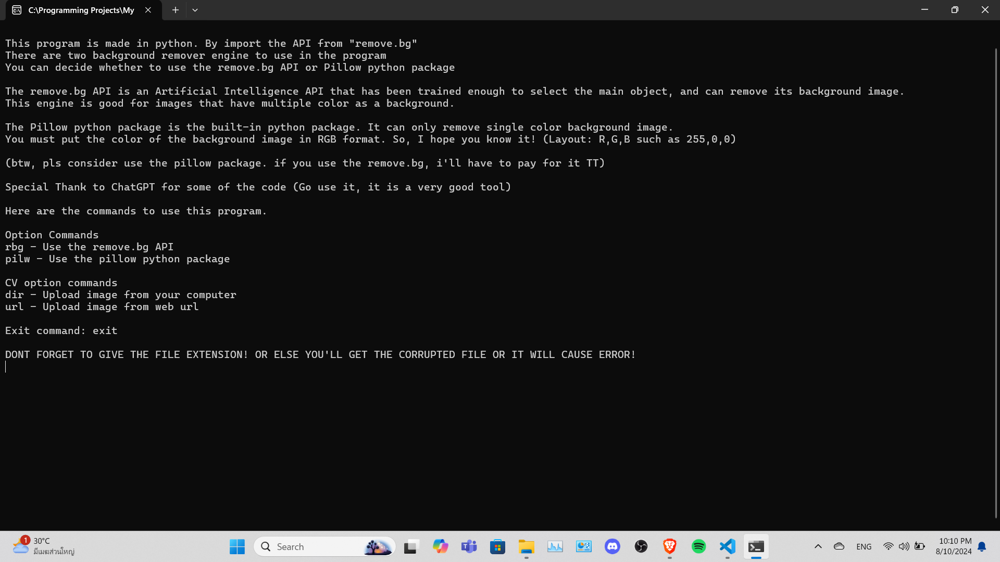

# Background Remover
As straightforward as its name, this program is used for removing background from an image and making it transparent. It's a CLI based program though, so you have to run the command to use it. I have already told you in the program the function of each command.
 
โปรแกรมนี้ใช้สำหรับลบพื้นหลังออกจากรูปภาพและทำให้โปร่งใส แม้ว่าโปรแกรมนี้จะใช้งานง่าย แต่ก็ใช้ CLI ดังนั้นคุณต้องรันคำสั่งนี้เพื่อใช้งาน ฉันได้บอกฟังก์ชันของแต่ละคำสั่งให้คุณทราบแล้วในโปรแกรม

The program is developed in Python and runs on two background remover engines.
 
โปรแกรมนี้พัฒนาด้วย Python และทำงานบนเครื่องมือลบพื้นหลังสองตัว
* "remove.bg" which is an API that use Artificial Intelligence to select the main object and remove the background. This engine is easy to use, and it provide image search from url. The quality of the outcome image is also high as well. However, The number of free uses of this API is rather low (Only 50 uses per month), so I don't quite recommend you to use this engine for now. 
__remove.bg__ เป็น API ที่ใช้ปัญญาประดิษฐ์ในการเลือกวัตถุหลักและลบพื้นหลัง เครื่องมือนี้ใช้งานง่ายและให้บริการค้นหารูปภาพจาก URL คุณภาพของรูปภาพผลลัพธ์ก็สูงเช่นกัน อย่างไรก็ตาม จำนวนการใช้งานฟรีของ API นี้ค่อนข้างต่ำ (เพียง 50 ครั้งต่อเดือน) ดังนั้นฉันไม่แนะนำให้คุณใช้เครื่องมือนี้ในตอนนี้

* "Pillow" is another background remover engine that is a module from Python. This one is completely free to use, but a bit harder to use. Because you need to input the RGB color code of the background you want to remove, which may make it isn't quite user friendly. 
__Pillow__ เป็นเครื่องมือลบพื้นหลังอีกตัวหนึ่งที่เป็นโมดูลจาก Python เครื่องมือนี้ใช้งานได้ฟรี แต่ใช้งานยากกว่าเล็กน้อย เนื่องจากคุณต้องป้อนรหัสสี RGB ของพื้นหลังที่ต้องการลบ ซึ่งอาจทำให้ไม่เป็นมิตรกับผู้ใช้นัก

**Here is the example of the image**
 
**นี่คือตัวอย่างภาพที่เราจะใช้ในการลบพื้นหลัง**

Before removing the white background
 
ก่อนลบพื้นหลังสีขาวออก

After removing the white background
 
หลังลบพื้นหลังสีขาวออก
